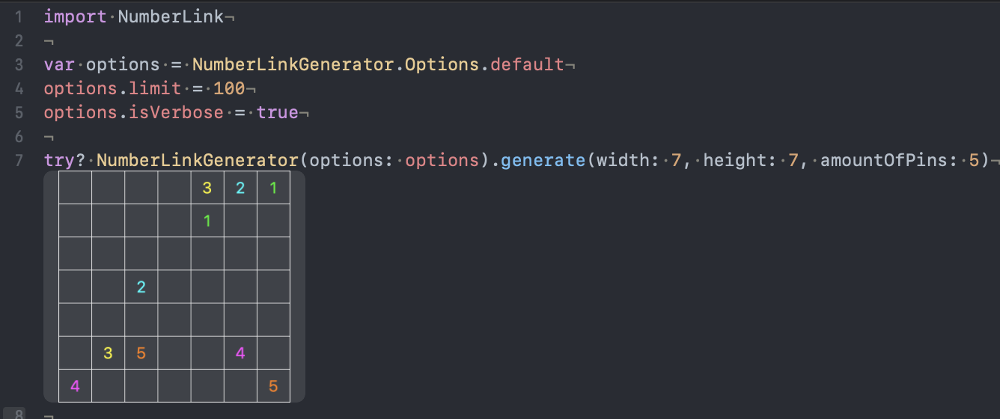

# NumberLink

[](https://travis-ci.com/Nonchalant/NumberLink)
[](https://swift.org)
[](https://github.com/Carthage/Carthage)
[](https://github.com/Nonchalant/NumberLink)
[](https://raw.githubusercontent.com/Nonchalant/NumberLink/master/LICENSE)


## Usage

```swift
import NumberLink

var options = NumberLinkGenerator.Options.default
options.limit = 100 // Attempts limit
options.isVerbose = true

let board = try? NumberLinkGenerator(options: options).generate(width: 7, height: 7, amountOfPins: 5)
```




## Required

- Swift 4.2
- Xcode 10.1


## Playground

You can try NumberLink on Xcode Playground.

1. Clone this
2. Open `NumberLink.xcworkspace`
3. Open `NumberLink.xcplayground`


## Installation

```
github "Nonchalant/NumberLink"
```


## Acknowledgement

**NumberLink** is a registered trademark of Nikoli Inc.
